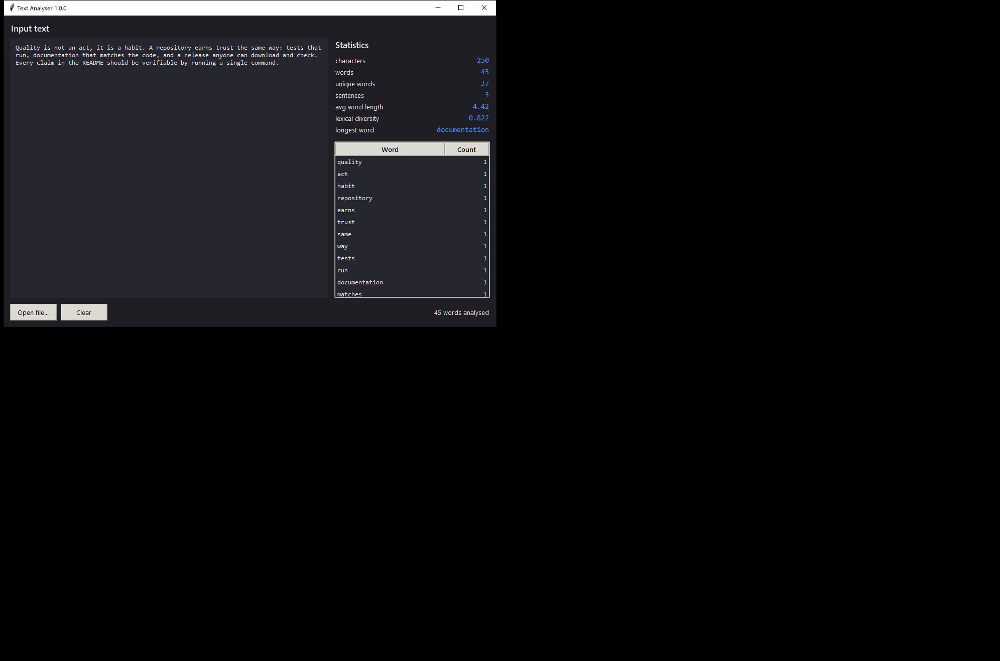
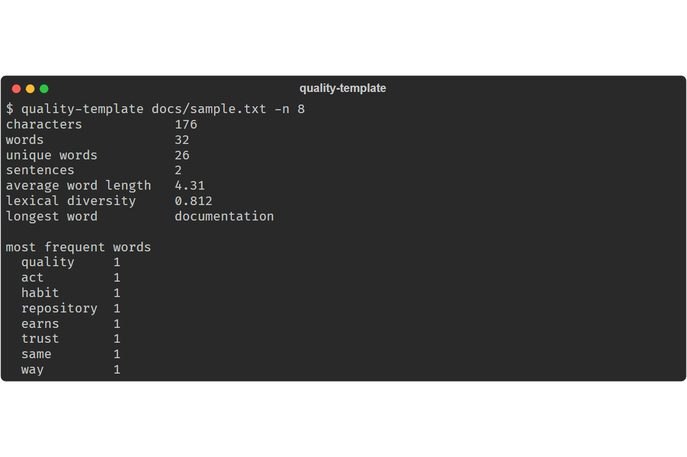

# Text Analyser

[](https://github.com/IGORSVOLOHOVS/repo-quality-template/actions/workflows/ci.yml)
[](https://github.com/IGORSVOLOHOVS/repo-quality-template/releases/latest)
[](LICENSE)
[](pyproject.toml)

Analyse a piece of text and report its statistics — word and sentence counts,
lexical diversity, and the words that actually carry meaning. Use it from the
terminal or in a desktop window.

It is also a **reference project layout**. Every quality control described below
is wired up and running, not described and aspirational. To reuse the layout on
another project, see [Reusing this layout](#reusing-this-layout).

---

## Screenshots

| Desktop window | Command line |
| --- | --- |
|  |  |

Both images are regenerated from the real program by
`python scripts/capture_usage_screenshots.py` — they cannot go stale silently.

---

## Install

Download a ready-made build from
[Releases](https://github.com/IGORSVOLOHOVS/repo-quality-template/releases/latest)
— a single `.exe` on Windows, a `.zip` elsewhere. No Python needed. Every file
ships a `.sha256` next to it.

From source:

```bash
git clone https://github.com/IGORSVOLOHOVS/repo-quality-template
cd repo-quality-template
python scripts/install_dependencies.py
```

---

## Use

```bash
# a file
quality-template docs/sample.txt

# standard input
cat notes.md | quality-template

# machine-readable, for a pipeline
quality-template report.txt --json

# the top 20 words, keeping "the", "of" and friends
quality-template report.txt -n 20 --keep-stop-words

# the desktop window
quality-template --gui
```

Output:

```
characters            238
words                 41
unique words          33
sentences             3
average word length   4.63
lexical diversity     0.805
longest word          documentation

most frequent words
  repository   2
  release      1
  download     1
```

| Flag | Meaning |
| --- | --- |
| `-n`, `--top N` | how many frequent words to show (default 10) |
| `--keep-stop-words` | include common function words |
| `--json` | machine-readable output |
| `--gui` | open the desktop window |
| `--version` | print the version |

---

## How it is built

Three layers, dependencies pointing one way: a pure domain layer with no I/O,
and two thin shells over it — a CLI and a tkinter window. Full reasoning,
including what was deliberately left out, in
[`docs/architecture.md`](docs/architecture.md).

---

## Quality

Assessed against **ISO/IEC 25010**. Four characteristics are measured
automatically on every push; four are argued in writing, citing those numbers.
See [`docs/quality-iso25010.md`](docs/quality-iso25010.md).

```bash
python scripts/collect_quality_metrics.py
```

| Control | Command | Enforced in CI |
| --- | --- | --- |
| Tests and coverage | `pytest --cov` | yes, fails below 85 % |
| Lint and format | `ruff check . && ruff format .` | yes |
| Types | `mypy`, strict, over `src/` | yes |
| Complexity ceiling | `ruff` rule `C90`, max 10 | yes |
| Benchmarks | `pytest benchmarks --benchmark-only` | yes |
| Profiling | `python scripts/profile_application.py` | on demand |
| Secret scan | `gitleaks` | yes, over full history |
| Branch policy | `python scripts/enforce_branch_policy.py` | yes |
| Contribution policy | `python scripts/enforce_contribution_policy.py` | yes, on every pull request |
| Bill of materials | `python scripts/generate_sbom.py` | yes, on every release |

### Measured performance

`benchmarks/test_performance.py`, median of many rounds:

| What is measured | Median |
| --- | ---: |
| `top_words` on an already-analysed text | 3.8 µs |
| `analyse_text` on 1 paragraph | 20.4 µs |
| `analyse_text` on 50 paragraphs | 836.4 µs |
| `tokenise` on 500 paragraphs | 5.92 ms |
| `analyse_text` on 500 paragraphs | 8.37 ms |

Analysis is linear in input length — 50 → 500 paragraphs is 10× the input for
10× the time — which is what the design predicts: one compiled regular
expression over the text and a `Counter` over the result, with no caching layer
to invalidate. Tokenising is 71 % of the total, so that regular expression is
where any optimisation would have to start.

```bash
pytest benchmarks --benchmark-only
```

---

## How a change travels

Issue, branch, commits, pull request, merge, release — and the first step is
not optional, because the issue is where the acceptance criteria are written
down. Full path in [`docs/workflow.md`](docs/workflow.md).

```bash
gh issue create                        # acceptance criteria go in here
git switch -c rqt-12/feat/slug dev
git commit -s -m "feat(core): ..."
python scripts/check_before_push.py
git push -u origin HEAD
gh pr create --base dev --fill         # the body says: Closes #12
```

Branch name, commit subjects, sign-off and the issue link are checked by
`contribution-policy.yml`, so none of them costs a review comment.

## Branches

Three long-lived branches — `release`, `dev`, `test` — plus short-lived work
branches named `<code>-<issue>/<type>/<slug>`, deleted when their pull request
merges. CI fails on anything else. See [`docs/branching.md`](docs/branching.md).

---

## Releasing

```bash
git checkout release && git merge --ff-only test
git tag -a v1.2.0 -m "v1.2.0" && git push origin release --tags
```

The tag runs the tests, builds the executable and the zip, writes a SHA-256 for
each and publishes a GitHub Release.

---

## Reusing this layout

```bash
python scripts/apply_template_to_repo.py --target ../some-project --dry-run
python scripts/apply_template_to_repo.py --target ../some-project --apply
```

It copies the infrastructure — workflows, issue and pull-request templates,
lint config, scripts, licence — leaves the target's own source alone, never
overwrites an existing file without `--force`, and prints which of the
standard's twenty-four points the target now satisfies and which still need
work by hand.

---

## Contributing

See [`CONTRIBUTING.md`](CONTRIBUTING.md) and
[`docs/workflow.md`](docs/workflow.md). Security policy:
[`SECURITY.md`](SECURITY.md). Conduct:
[`CODE_OF_CONDUCT.md`](CODE_OF_CONDUCT.md).

## Where the standard came from

The twenty-four points are measured against the OpenSSF Best Practices Badge
and OpenSSF Scorecard in
[`docs/standards-comparison.md`](docs/standards-comparison.md). The criteria
this project deliberately does not meet are argued, one by one, in
[`docs/decisions.md`](docs/decisions.md).

## License

MIT — see [`LICENSE`](LICENSE). Copyright (c) 2026 Igors Volohovs.
